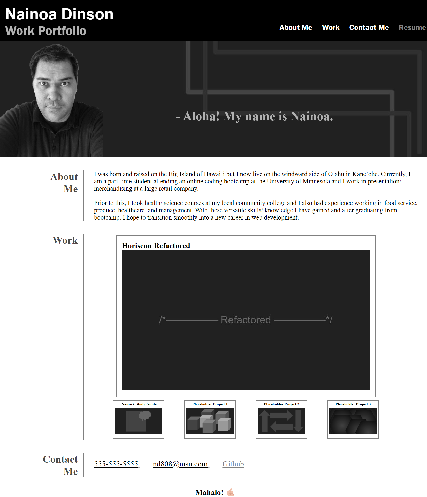

# work-portfolio

## Description

This project is a work portfolio page created from scratch with no starter code or documents. The purpose of this application is to showcase my skills and talents with the work I have completed so far.
In addition, I will be able to switch out placeholder items for future projects/ documents as things progress. My contact information is also provided as a wsy for colleagues and future employers to get a hold of me. 

## Tasks Completed

- Included my name and recent photo.
- Created links corresponding to the different titled sections in my portfolio ("About Me", "Work", "Contact Me")
- Created a link which opens a placeholder "resume" document
- Created images corresponding to each work project and made the first application the largest
- Created links to contact information
- Linked each project to their deployed websites, with the exception of placeholder items for future projects
- Created a responsive layout that adapts to different viewports

## Links

Deployed Website: https://ndinson.github.io/work-portfolio/

GitHub Code Repository: https://github.com/ndinson/work-portfolio

## Installation

Deploy repository containing index.html, README.md, and assets folder (containing CSS and image files) to a web server.

## Usage

The deployed application can be viewed through a desktop web browser. It is also optimized for any screen sizes, including resolutions smaller than 768px.

The following image shows the up to date appearance and functionality of my Work Portfolio webpage:

## Credits
- Instructional Staff at the University of Minnesota Coding Bootcamp
- MDN Web Docs

## License

MIT License

Copyright (c) 2023 Nainoa Dinson

Permission is hereby granted, free of charge, to any person obtaining a copy
of this software and associated documentation files (the "Software"), to deal
in the Software without restriction, including without limitation the rights
to use, copy, modify, merge, publish, distribute, sublicense, and/or sell
copies of the Software, and to permit persons to whom the Software is
furnished to do so, subject to the following conditions:

The above copyright notice and this permission notice shall be included in all
copies or substantial portions of the Software.

THE SOFTWARE IS PROVIDED "AS IS", WITHOUT WARRANTY OF ANY KIND, EXPRESS OR
IMPLIED, INCLUDING BUT NOT LIMITED TO THE WARRANTIES OF MERCHANTABILITY,
FITNESS FOR A PARTICULAR PURPOSE AND NONINFRINGEMENT. IN NO EVENT SHALL THE
AUTHORS OR COPYRIGHT HOLDERS BE LIABLE FOR ANY CLAIM, DAMAGES OR OTHER
LIABILITY, WHETHER IN AN ACTION OF CONTRACT, TORT OR OTHERWISE, ARISING FROM,
OUT OF OR IN CONNECTION WITH THE SOFTWARE OR THE USE OR OTHER DEALINGS IN THE
SOFTWARE.
